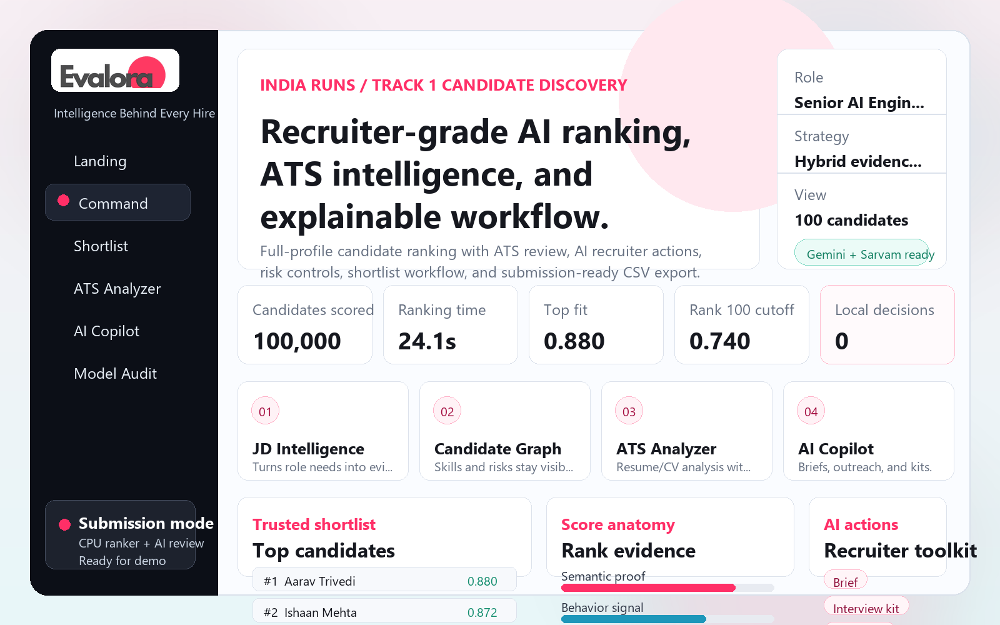

<div align="center">


# Evalora

### Intelligence Behind Every Hire

[](LICENSE)
[](https://python.org)
[](https://djangoproject.com)
[](https://nodejs.org)
[](https://ai.google.dev)
[](https://sarvam.ai)
[](https://github.com/yuvrajjitbaruah/Evalora/stargazers)

[Report a Bug](https://github.com/yuvrajjitbaruah/Evalora/issues) · [Request a Feature](https://github.com/yuvrajjitbaruah/Evalora/issues)

</div>

---

## Overview

**Evalora** is a recruiter-grade AI candidate ranking and ATS intelligence platform. Instead of shallow keyword matching, Evalora scores candidates across five dimensions — career evidence, semantic fit, behavioral readiness, logistics, and risk signals — delivering a trusted, deterministic shortlist your team can act on.

Built with Python, Django, a deterministic hybrid ranking engine (Node.js), and optional AI augmentation via Google Gemini and Sarvam AI.

> **Stack:** Python · Django · JavaScript · Node.js · Gemini 2.5 Flash · Sarvam 30B

---

## Screenshot



---

## Features

| Area | What it does |
|---|---|
| **Ranking Engine** | Streams the full candidate pool and ranks deterministically — no per-candidate hosted model calls |
| **Shortlist Console** | Search, filters, table/card views, fit tags, risk notes, comparison mode, and decision workflow |
| **ATS Analyzer** | Reviews pasted resume text or uploaded `.txt`, `.docx`, and `.pdf` files against the target role |
| **AI Copilot** | Generates recruiter briefs, interview kits, scorecards, risk audits, outreach drafts, and Boolean queries |
| **AI Provider Routing** | Auto-routes to Gemini or Sarvam when configured; falls back to deterministic local result gracefully |
| **Secure by Default** | `.env.local`, databases, virtualenvs, and raw datasets are excluded from version control |

---

## Tech Stack
Frontend   →  HTML · CSS · Vanilla JS
Backend    →  Python 3.12 · Django 5.x
Ranker     →  Node.js 20 (built-in APIs, zero dependencies)
AI Layer   →  Google Gemini 2.5 Flash · Sarvam 30B · Local deterministic fallback
Storage    →  SQLite (dev) · Production DB ready
Config     →  .env.local (never committed)

---

## Project Structure

```text
Evalora/
├── evalora_project/        # Django settings and root URL config
├── recruiter/              # Main app — views, API, AI services, templates, static UI
├── src/
│   └── ranker/             # Deterministic Node.js ranking and CSV validation engine
├── public/
│   ├── data/               # Generated dashboard data (JSON)
│   └── js/                 # Standalone ranking core for static preview
├── outputs/                # Submission CSV files
├── docs/                   # Methodology notes and screenshots
├── data/                   # Dataset placement (raw data excluded from repo)
├── scripts/                # Utility scripts
├── manage.py               # Django entry point
├── requirements.txt        # Python dependencies
└── package.json            # Node scripts (rank, validate)
```

## Getting Started

### Prerequisites

- Python **3.12+**
- Node.js **20+** *(only needed to regenerate ranking CSV)*
- Git

---

### Installation

**Clone the repository**

```bash
git clone https://github.com/yuvrajjitbaruah/Evalora.git
cd Evalora
```

**Create and activate a virtual environment**

```bash
# macOS / Linux
python3 -m venv .venv
source .venv/bin/activate

# Windows (PowerShell)
python -m venv .venv
.\.venv\Scripts\Activate.ps1
```

**Install Python dependencies**

```bash
pip install --upgrade pip
pip install -r requirements.txt
```

**Set up environment variables**

```bash
# macOS / Linux
cp .env.example .env.local

# Windows
copy .env.example .env.local
```

**Run migrations and start the server**

```bash
python manage.py migrate
python manage.py runserver 127.0.0.1:8000
```

Open [http://127.0.0.1:8000](http://127.0.0.1:8000) in your browser.

---

## AI Configuration

Edit `.env.local` with your API keys. **Never commit this file.**

```env
DJANGO_SECRET_KEY=your_django_secret_key
DJANGO_DEBUG=1
DJANGO_ALLOWED_HOSTS=127.0.0.1,localhost

GOOGLE_AI_API_KEY=your_google_ai_key
GEMINI_API_KEY=your_google_ai_key
SARVAM_API_KEY=your_sarvam_key

GEMINI_MODEL=gemini-2.5-flash
SARVAM_MODEL=sarvam-30b
AI_REQUEST_TIMEOUT_SECONDS=20
```

**Provider routing behavior:**

- `auto` — selects the best available configured cloud provider
- `gemini` — forces Gemini (requires `GOOGLE_AI_API_KEY`)
- `sarvam` — forces Sarvam (requires `SARVAM_API_KEY`)
- If no provider is reachable, Evalora returns a deterministic local result with a visible warning

---

## Dataset Setup

The raw dataset should **not** be committed to the repository. Place it locally at:
data/raw/India_runs_data_and_ai_challenge/

Expected files:
candidates.jsonl
sample_candidates.json
candidate_schema.json
job_description.docx
submission_spec.docx
redrob_signals_doc.docx

---

## Running the Ranker

```bash
# Full ranking pipeline
npm run rank

# Sample pipeline only
npm run rank:sample

# Validate the output CSV
npm run validate
```

**Outputs generated:**
outputs/evalora_submission.csv
public/data/top_candidates.json
public/data/score_report.json

The validator checks headers, row count, rank order, score ordering, candidate uniqueness, and reasoning text completeness.

---

## API Reference

| Route | Method | Description |
|---|---|---|
| `/` | `GET` | Evalora dashboard |
| `/api/candidates/` | `GET` | Ranked top-candidate payload |
| `/api/report/` | `GET` | Score report and model summary |
| `/api/sample/` | `GET` | Bundled sample candidates |
| `/api/rank-sample/` | `POST` | Rank an uploaded JSON/JSONL sample |
| `/api/ai/status/` | `GET` | Gemini/Sarvam configuration status |
| `/api/ai/candidate-action/` | `POST` | AI Copilot recruiter action |
| `/api/ats/analyze/` | `POST` | ATS resume/CV analysis |
| `/download/submission/` | `GET` | Download ranked CSV |

---

## Production Deployment

```bash
python manage.py collectstatic
```

| Setting | Production Value |
|---|---|
| `DJANGO_DEBUG` | `0` |
| `DJANGO_SECRET_KEY` | Strong random secret |
| `DJANGO_ALLOWED_HOSTS` | Your domain only |
| API Keys | Store in hosting provider's secret manager |
| Database | Switch from SQLite to PostgreSQL |

---

## Troubleshooting

<details>
<summary><strong><code>python</code> is not recognized on Windows</strong></summary>

Install Python 3.12+ and reopen the terminal. Try:

```powershell
py -3 -m venv .venv
```

</details>

<details>
<summary><strong>PowerShell blocks virtual environment activation</strong></summary>

```powershell
Set-ExecutionPolicy -Scope CurrentUser RemoteSigned
.\.venv\Scripts\Activate.ps1
```

</details>

<details>
<summary><strong>AI shows local fallback warning</strong></summary>

Check `.env.local` and verify:
- `GOOGLE_AI_API_KEY` or `GEMINI_API_KEY` is set for Gemini
- `SARVAM_API_KEY` is set for Sarvam
- The Django server was restarted after editing `.env.local`
- The machine running Django has internet access

</details>

<details>
<summary><strong>PDF resume extraction returns weak results</strong></summary>

Some PDFs are scanned images without selectable text. Paste extracted resume text directly into the ATS Analyzer, or upload a `.docx` or `.txt` file instead.

</details>

<details>
<summary><strong><code>npm run validate</code> cannot find candidates</strong></summary>

Ensure the dataset is placed under `data/raw/India_runs_data_and_ai_challenge/`, then rerun `npm run validate`.

</details>

---

## Contributing

Contributions are welcome. To contribute:

1. Fork the repository
2. Create a feature branch (`git checkout -b feature/your-feature`)
3. Commit your changes (`git commit -m 'feat: add your feature'`)
4. Push to the branch (`git push origin feature/your-feature`)
5. Open a Pull Request

---

## License

Distributed under the **Apache License 2.0**. See [`LICENSE`](LICENSE) for full terms.

---

## Author

**Yuvrajjit Baruah**

[](https://linkedin.com/in/yuvrajjitbaruah)
[](https://github.com/yuvrajjitbaruah)
[](mailto:dev.yuvrajjitbaruah@gmail.com)

---

<div align="center">

⭐ **If Evalora helped you, give it a star!** ⭐

</div>
